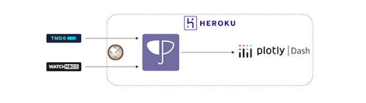

### Streaming-Metrics
---
[Link to App](https://stream-metrics-b5f68d63e431.herokuapp.com/)

This is a Plotly Dash application for comparing the content catalogs of different streaming platforms in the United States. Drill down to identify which platforms are best for a given genre, language, etc. The data is sourced from (but not endorsed by!) the [TMDB API](https://developer.themoviedb.org/docs/getting-started) and the [Watchmode API](https://api.watchmode.com/). Data is refreshed every two weeks (the most frequent I can get away with without paying). If you are interested in running the app locally, this repository includes a demo_data.parquet file that contains a subset of data



#### Built With
---
- [Dash](https://dash.plotly.com/)
- [Plotly](https://plotly.com/python/)
- [Dash Bootstrap Components](https://dash-bootstrap-components.opensource.faculty.ai/)
- [Pandas](https://pandas.pydata.org/)
- [Black](https://github.com/psf/black)


#### Deployment
---
This app is deployed using [Heroku](https://heroku.com). Data for the app is stored in a managed Postgres add-on offered by Heroku. The data is updated once every two weeks using Heroku Scheduler.


#### Running Locally 
---
*My local environment: Python 3.9, macOS. Steps might be (slightly) different depending on your setup*

* Clone the repo, including the example data:
```
git clone https://github.com/wnhoj/streaming-metrics.git
```
* Create and activate a new virtual environment:
```
cd streaming-metrics
python -m venv venv
source venv/bin/activate
```
* Install requirements:
```
pip install -r requirements.txt
```
* Run the app!
```
python app.py
```


#### Contact
---
[johnjephwolf@gmail.com](mailto:johnjephwolf@gmail.com)